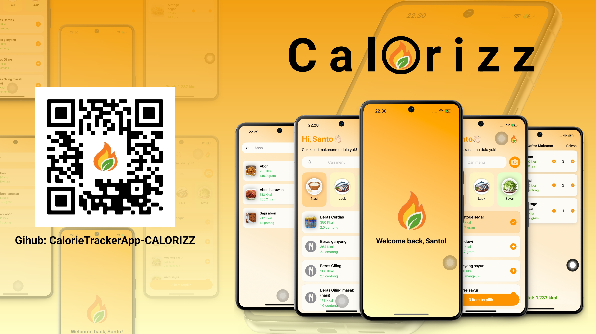

<h1 align="center">CALORIETRACKERAPP – CALORIZZ</h1>

<p align="center">
  <em>Know Your Daily Calories With Calorizz</em>
</p>

<p align="center">
  
  
  
</p>

---

## Overview

**CalorieTrackerApp – CALORIZZ** is a versatile development toolkit designed for building health and nutrition apps on iOS.  
It provides utilities for data handling, an AI-powered food recognition system, and well-structured UI components to help developers create seamless user experiences.

### Why Choose CALORIZZ?

This project simplifies complex UI tasks, ensures reliable data storage, and manages high-quality visual assets.  
Its core features include:

- **SwiftUI & Numerical Extensions** – Simplifies formatting, rounding, and view customization for a polished interface.
- **Core Data Management** – Reliable data storage and seamless access to user food logs.
- **Asset Catalog Organization** – Efficient management of scalable, high-quality food images for visual consistency.
- **Food Recognition** – Integration with CoreML and Vision for real-time food detection and calorie analysis.
- **User Interface Components** – Ready-to-use, intuitive components for browsing, searching, and managing food items.
- **Developer Tools** – Built-in debugging utilities and workspace state preservation for smooth development.

---

## App Preview

<p align="center">
  
</p>

---

## Features

- **Food Categories** – Organized list by type: rice, protein, vegetables, fruits, drinks, dessert.
- **Search Bar** – Quickly find any food in the list.
- **Camera Scan (AI Powered)** – Detects food using CoreML & Vision and estimates calories.
- **Total Calorie Calculation** – Automatically calculates the calories of selected items.
- **Simple & Fast UI** – Clean interface designed for busy users.

---

## Built With

<p>
  
  
  
  
</p>

---

## Installation

1. Clone the repository:

```bash
git clone https://github.com/username/Calorizz.git


